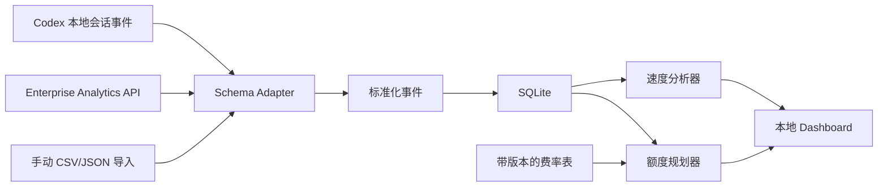

# Codex Quota Lens

## Codex 插件（推荐）

仓库现在提供 `0.2.0` 的 Codex App + Skill 插件。插件通过本地 MCP 工具在支持 MCP Apps 的 Codex 对话中渲染交互面板，也保留只绑定 `127.0.0.1` 的浏览器 Dashboard 作为兼容回退。

在 Codex CLI 中运行：

```bash
codex plugin marketplace add chun98957-create/Codex-Quota-Lens
codex plugin add codex-quota-lens@codex-quota-lens
```

然后新建一个 Codex 任务，让插件技能进入任务上下文。插件入口位于 `plugins/codex-quota-lens`，marketplace 清单位于 `.agents/plugins/marketplace.json`。

安装后可以直接说：

- “打开 Codex Quota Lens 额度面板”
- “打开速度面板，看看我什么时候使用额度最快”
- “打开规划器，按模型和推理强度帮我规划额度”
- “在浏览器打开 Codex Quota Lens Dashboard”（兼容回退）

插件只读取本机 Codex 会话中的数字额度与 token 遥测字段，不上传对话内容。当前数据源是本地观察值，并非官方配额 API。

> Codex/ChatGPT 宿主决定面板最终以内嵌卡片、弹窗或其他支持的界面呈现；插件不能强制创建永久固定的右侧栏。若要把同一个 MCP App 发布到 ChatGPT 插件目录，还需要部署 HTTPS MCP 服务，并在开发者模式中创建真实的 `plugin_asdk_app...` ID；仓库不会伪造该 ID。

> 本地优先的 Codex 额度观测、消耗分析与使用规划工具。

Codex Quota Lens 将 Codex 的额度窗口、token 消耗和任务历史转换为可操作的结论：还剩多少、什么时间消耗最快、按当前速度是否会提前耗尽，以及不同模型和推理强度可能带来的额度影响。

## 为什么做这个项目

Codex 的单次任务消耗并不固定。任务规模、上下文长度、模型、推理量、运行位置和缓存命中都会改变实际消耗。只看“剩余百分比”无法回答三个更重要的问题：

1. 我现在的额度和重置时间是什么？
2. 我的额度在哪些时段、项目和任务类型上消耗最快？
3. 为了让额度坚持到重置，我应该怎样选择模型、推理强度和任务节奏？

## 核心能力

### 1. 实时额度仪表盘

- 当前额度窗口的已用/剩余百分比
- 窗口长度、重置时间和倒计时
- input、cached input、output、reasoning token 曲线
- 数据新鲜度与来源标识：`官方值`、`本地观测`、`估算值`

### 2. 消耗速度分析

- 5 分钟、1 小时和 1 天滚动消耗速度
- 小时 × 星期热力图
- 消耗最快的 Top N 时间段
- 按项目、模型、推理强度和任务类型聚合
- 异常突增检测，以及可能原因解释

### 3. 额度规划器

- “按当前速度将在何时耗尽”的 ETA
- 为坚持到重置而计算的建议消耗速度
- 模型 × 推理强度 × 每日任务数的情景模拟
- 保守、中性、激进三种方案
- 给出区间与置信度，不制造虚假的精确数字

## 产品原则

- **本地优先**：默认只读取本机 Codex 遥测事件，数据不上传。
- **不读取任务内容**：只提取 token、额度、时间、模型和匿名项目标识。
- **不伪装成官方 API**：本地会话格式属于实验性数据源，必须通过适配器隔离。
- **观测与预测分离**：官方/本地观测值和模型推测值在 UI 中使用不同视觉语义。
- **费率可追溯**：费率表带来源、版本和生效时间，过期时停止给出确定性建议。

## 可行性结论

MVP 可以从本地 Codex JSONL 会话事件中增量读取：

- `input_tokens`
- `cached_input_tokens`
- `output_tokens`
- `reasoning_output_tokens`
- `used_percent`
- `window_minutes`
- `resets_at`

这些字段足以绘制实时额度曲线和速度分析。不过，本地事件格式不是承诺稳定的公共接口，因此项目必须保留 schema 版本检测、兼容适配器和手动导入兜底。企业版后续可接入 Codex Enterprise Analytics/Compliance API。

## 页面设计

| 页面 | 关键问题 | 主要组件 |
| --- | --- | --- |
| Overview | 还剩多少？能撑到重置吗？ | 额度环、重置倒计时、实时曲线、风险提示 |
| Speed | 什么时候用得最快？ | 滚动速率、热力图、Top 时段、异常点 |
| Planner | 应该怎样分配额度？ | 场景表、模型/推理强度选择、任务预算、预测区间 |
| Settings | 数据从哪里来？是否可靠？ | 数据源状态、隐私选项、费率版本、导入导出 |

## 技术方案

- Desktop：Tauri 2
- UI：React + TypeScript + ECharts
- Core：Rust
- Storage：SQLite
- Data ingestion：文件监听 + JSONL 增量游标
- Tests：Rust unit/integration tests + Playwright UI tests

选择桌面应用是因为个人用户的核心数据在本地，且需要持续、安全地观察会话文件。未来可以增加只读 Web UI，但不应要求用户上传原始会话。



详细设计见：

- [产品规格](docs/PRODUCT_SPEC.md)
- [系统架构](docs/ARCHITECTURE.md)
- [计算与预测算法](docs/ALGORITHMS.md)
- [GitHub 发布路线](docs/GITHUB_LAUNCH.md)

## 交互体验版

仓库包含一个本地只读体验版，覆盖真实额度概览、速度热力图和额度规划器：

```bash
python prototype/server.py --port 4173
```

然后访问 `http://127.0.0.1:4173/prototype/`。服务只绑定 `127.0.0.1`，只从 Codex 会话事件中提取数字额度与 token 字段，不返回 prompt、response、reasoning 或工具内容。

速度页与实时速度分开计算：历史热力图只统计最近 28 天，以 15 分钟固定窗口聚合；页面会显示具体日期和样本数，少于 3 个有效窗口时标记为“数据不足”，不把单个旧样本误报成稳定规律。

## MVP 范围

MVP 只做四件事：

1. 自动发现并只读监听 Codex 本地会话目录。
2. 标准化 token 与额度快照，写入本地 SQLite。
3. 展示实时剩余额度、重置时间、滚动速度和最快时段。
4. 基于个人历史基线与版本化费率表，模拟模型/推理强度方案。

MVP 不做：网页登录抓取、自动修改 Codex 模型设置、云端同步、团队排名、购买额度或自动充值。

## 数据可信度

| 等级 | 含义 | 示例 |
| --- | --- | --- |
| A | 官方或客户端直接提供 | 当前 used percent、reset time |
| B | 从本地事件精确计算 | token 增量、历史时段速度 |
| C | 个人历史校准后的预测 | 某模型下未来任务成本区间 |
| D | 缺少历史时的先验估计 | 新用户首次情景模拟 |

任何预测卡片都必须显示等级、样本量、更新时间和区间。

## 官方依据与动态变化

OpenAI 当前说明 Codex 消耗会随任务大小、复杂度、模型和运行方式变化；额度可能与其他 agentic 功能共享。当前费率以 input、cached input 和 output token 计价，而且模型列表和费率会变化。因此仓库不把某一时点的模型/费率写死在业务逻辑中。

- [Using Codex with your ChatGPT plan](https://help.openai.com/en/articles/11369540-using-codex-with-your-chatgpt-plan/)
- [Codex rate card](https://help.openai.com/en/articles/20001106-codex-rate-card-2)
- [OpenAI model catalog](https://developers.openai.com/api/docs/models/all)

## 建议的 GitHub 信息

- Repository：`codex-quota-lens`
- Description：`Local-first Codex quota dashboard, burn-rate analytics, and usage planner.`
- Topics：`codex`, `openai`, `tauri`, `usage-analytics`, `quota`, `developer-tools`, `local-first`
- License：MIT

## 状态

当前仓库是设计阶段骨架。推荐先完成数据采集 CLI 和匿名 fixture，再开发桌面 UI。

## 免责声明

本项目是社区项目，与 OpenAI 无隶属或官方认可关系。Codex、模型、额度和费率可能随产品更新而变化；预测仅用于个人规划，不代表账单或服务可用性承诺。
