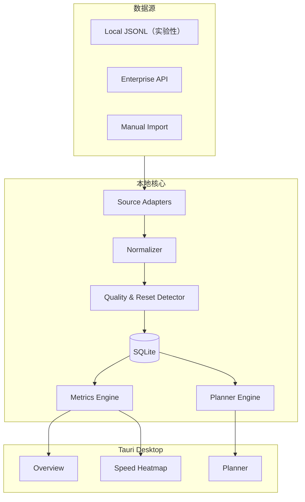

# 系统架构

## 1. 总览

系统采用本地优先、事件驱动和适配器架构。原始数据只在采集层短暂停留，标准化后只保存完成分析所需的数值元数据。



## 2. 建议的仓库结构

```text
codex-quota-lens/
├─ apps/
│  └─ desktop/               # Tauri + React
├─ crates/
│  ├─ collector/             # 文件发现、监听、增量游标
│  ├─ schema/                # 原始 schema 适配器与标准化类型
│  ├─ storage/               # SQLite migrations/repositories
│  ├─ analytics/             # burn rate、heatmap、异常检测
│  └─ planner/               # 情景模拟与置信区间
├─ fixtures/
│  ├─ synthetic/             # 只允许匿名合成数据
│  └─ schema-versions/
├─ rate-cards/               # 带版本和来源的模型费率目录
├─ docs/
└─ .github/
```

## 3. 数据源

### Local JSONL Adapter

职责：

- 跨平台发现 Codex session 目录
- 记录每个文件的 inode/file-id、offset、size 和 last modified
- 只解析允许的事件类型与字段
- 文件截断或轮转后安全恢复
- 未知 schema 进入 quarantine，不让应用崩溃

允许提取：

- timestamp、session/thread id 的单向哈希
- token totals/deltas
- rate-limit snapshot
- model、reasoning effort（存在时）
- cwd/project 的加盐哈希或用户设置的别名

禁止持久化：

- prompt、response、reasoning 内容
- tool input/output
- 文件内容与绝对路径
- auth token、cookie、API key

### Enterprise Adapter

用于有权限的组织。凭据放入系统 keychain，分页游标与速率限制独立管理。Enterprise 数据与本地数据通过 source + external event id 去重。

### Import Adapter

支持用户主动导入经过审查的 CSV/JSON。导入前显示字段预览和隐私警告。

## 4. 标准化事件

```rust
struct UsageEvent {
    event_id: String,
    observed_at: DateTime<Utc>,
    source: SourceKind,
    session_hash: Option<String>,
    project_hash: Option<String>,
    model: Option<String>,
    reasoning_effort: Option<String>,
    input_tokens: u64,
    cached_input_tokens: u64,
    output_tokens: u64,
    reasoning_output_tokens: u64,
    quality: QualityGrade,
}

struct LimitSnapshot {
    observed_at: DateTime<Utc>,
    limit_id: Option<String>,
    used_percent: f64,
    window_minutes: u32,
    resets_at: DateTime<Utc>,
    source: SourceKind,
    quality: QualityGrade,
}
```

计数器可能是累计值，Normalizer 必须用相邻事件做差，并处理：

- 新 session
- 客户端重启
- 计数器回退
- 重复事件
- 时钟漂移

## 5. SQLite 表

### usage_events

`id, observed_at, source, session_hash, project_hash, model, effort, input, cached_input, output, reasoning_output, quality`

### limit_snapshots

`id, observed_at, limit_key, used_percent, window_minutes, resets_at, reset_epoch, source, quality`

### source_cursors

`source_path_hash, file_identity, byte_offset, size, modified_at, schema_version`

### rate_cards

`catalog_version, effective_from, fetched_at, source_url, model, input_rate, cached_rate, output_rate, speed_multiplier, status`

### workload_profiles

`profile_id, name, model, effort, sample_count, token_quantiles_json, updated_at`

## 6. 重置检测

满足任一条件时创建新的 reset epoch：

1. `resets_at` 明显改变且进入新窗口；
2. `used_percent` 从高值跌至低值，同时接近原 reset time；
3. limit id 改变；
4. 用户手动标记重置。

不允许跨 reset epoch 计算 `delta used_percent`。

## 7. 实时更新

文件监听器只发出“可能变化”信号，实际读取以游标为准。Watcher 事件需要 200–500ms debounce。Core 通过 Tauri event channel 向 UI 发布小型 metric update，UI 每秒最多重绘一次。

## 8. 安全设计

- 首次启动明确展示读取目录和字段白名单
- 默认绑定 `127.0.0.1`，不暴露局域网端口
- 数据库不保存原始文本；可选 SQLCipher 加密
- 项目标识使用本机随机 salt 的 HMAC
- 日志进行 secret redaction
- 导出默认只包含聚合值
- 自动更新包必须签名

## 9. 兼容性策略

每个适配器声明：

- `can_parse(sample) -> confidence`
- `schema_version()`
- `normalize(raw) -> Result<Vec<NormalizedEvent>>`

CI 使用合成 fixtures 覆盖已知版本。遇到未知版本时：

1. 停止解析该文件；
2. 保留 offset；
3. UI 显示 schema unsupported；
4. 允许用户生成只含字段名和类型的诊断包。

## 10. 不建议的实现

- 抓取已登录网页来读取额度：认证脆弱且风险高。
- 把用户完整 session 上传到托管后端：与本地优先目标冲突。
- 用固定“高推理 = 2x”倍率：缺少可靠依据。
- 在代码里硬编码当前模型和费率：会快速过期。

